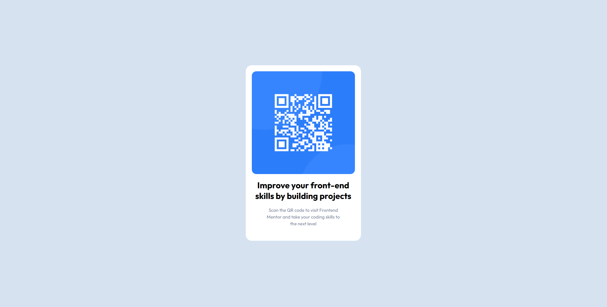

# Frontend Mentor - QR code component solution

This is a solution to the [QR code component challenge on Frontend Mentor](https://www.frontendmentor.io/challenges/qr-code-component-iux_sIO_H). Frontend Mentor challenges help you improve your coding skills by building realistic projects. 

## Table of contents

- [Overview](#overview)
  - [Screenshot](#screenshot)
  - [Links](#links)
- [My process](#my-process)
  - [Built with](#built-with)
  - [What I learned](#what-i-learned)
  - [Continued development](#continued-development)
  - [Useful resources](#useful-resources)
- [Author](#author)
- [Acknowledgments](#acknowledgments)

## Overview

 i've created a QR component  that was similar to the one you guys gave me. 

### Screenshot

### Links

- Solution URL: [Add solution URL here](https://github.com/Sheriff702/qr-code-component)
- Live Site URL: [Add live site URL here](https://sheriff702.github.io/qr-code-component/)

## My process

### Built with

- Semantic HTML5 markup
- CSS
- Flexbox
- Google Fonts

### What I learned

I've learned how to center the whole picture with everything in it. 

### Useful resources

- [resource 1](https://fonts.google.com/) -For Fonts

## Author

- Frontend Mentor - [@sheriff702](https://www.frontendmentor.io/profile/Sheriff702)
- Twitter - [@svarta_shunon](https://twitter.com/svarta_shunon)
- Linkedin - [sheriff702](https://www.linkedin.com/in/sheriff702/)

## Acknowledgments

i've gotten help from a friend and this is his github - (https://github.com/hassanidris)

